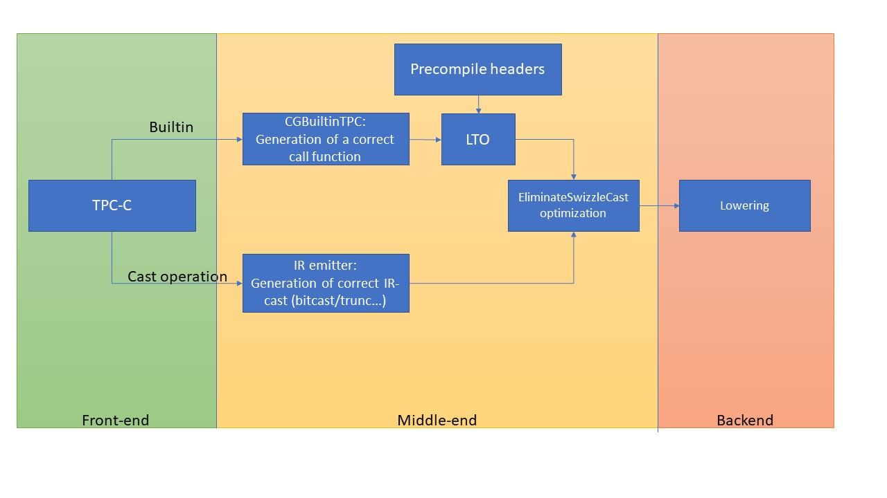

###################
TPC Builtin Support 
###################

*********
Overview:
*********

| This documentation covers the following subject:
| 1) Cast functions:
| 1.1) Builtin Swizzle and linear cast.
| 1.2) C cast operators.
| 2) Special functions:

*********
Lowering:
*********

**********************
Builtin API front end:
**********************

cast function
=============

Objectives
----------
#. The compiler shall support the following cast operation:
    #. Perf-lib helper cast builtin table (tpc-defs.h/tpc-special.h)

    #. as_T(x) builtin. (linear order)

    #. as_T(x, round mode) builtin. (linear order)

    #. Implicit Type Conversion

    #. Explicit type casting

    #. interpreted cast

1. __builtin_cast.* table
-------------------------
1) The cast helper contains the listed function without prefix __builtin_.
2) The user shall use this builtin with a basic type (one VRF E.g. int64|float64 )

+--------+---------------------------------------------------+-----------------------------------------------+
| Device |   Builtin                                         | builtin definition output(input)              |
+========+===================================================+===============================================+
|  Goya  |         __builtin_cast_i16_to_i8_lin_order        |          char256 (short128, short128)         |
+--------+---------------------------------------------------+-----------------------------------------------+
|  Goya  |        __builtin_cast_i32_to_i16_lin_order        |          short128 (int64, int64, int)         |
+--------+---------------------------------------------------+-----------------------------------------------+
|  Goya  |        __builtin_cast_f32_to_i16_lin_order        |       short128 (float64, float64, float)      |
+--------+---------------------------------------------------+-----------------------------------------------+
|  Goya  |        __builtin_cast_f32_to_u16_lin_order        |      ushort128 (float64, float64, float)      |
+--------+---------------------------------------------------+-----------------------------------------------+
|  Goya  | __builtin_cast_f32_to_u16_lin_order_without_scale |          ushort128 (float64, float64)         |
+--------+---------------------------------------------------+-----------------------------------------------+
|  Goya  |         __builtin_cast_f32_to_u8_lin_order        | uchar256 (float64, float64, float64, float64) |
+--------+---------------------------------------------------+-----------------------------------------------+
|  Goya  |         __builtin_cast_u8_to_i16_lin_order        |           short128_pair_t (uchar256)          |
+--------+---------------------------------------------------+-----------------------------------------------+
|  Goya  |         __builtin_cast_u8_to_u16_lin_order        |          ushort128_pair_t (uchar256)          |
+--------+---------------------------------------------------+-----------------------------------------------+
|  Goya  |        __builtin_cast_i16_to_i32_lin_order        |          int64_pair_t (short128, int)         |
+--------+---------------------------------------------------+-----------------------------------------------+
|  Goya  |    __builtin_cast_i16_to_i32_lin_order_no_shift   |            int64_pair_t (short128)            |
+--------+---------------------------------------------------+-----------------------------------------------+
|  Goya  |        __builtin_cast_u16_to_f32_lin_order        |       float64_pair_t (ushort128, float)       |
+--------+---------------------------------------------------+-----------------------------------------------+
|  Goya  | __builtin_cast_u16_to_f32_lin_order_without_scale |           float64_pair_t (ushort128)          |
+--------+---------------------------------------------------+-----------------------------------------------+
|  Goya  |        __builtin_cast_u8_to_32bits_lin_order      |               uint256 (uchar256)              |
+--------+---------------------------------------------------+-----------------------------------------------+
|  Gaudi |         __builtin_cast_u16_to_u8_lin_order        |        uchar256 (ushort128, ushort128)        |
+--------+---------------------------------------------------+-----------------------------------------------+
|  Gaudi |        __builtin_cast_i32_to_i16_lin_order        |          short128 (int64, int64, int)         |
+--------+---------------------------------------------------+-----------------------------------------------+
|  Gaudi |        __builtin_cast_f32_to_i16_lin_order        |       short128 (float64, float64, float)      |
+--------+---------------------------------------------------+-----------------------------------------------+
|  Gaudi |        __builtin_cast_f32_to_u16_lin_order        |      ushort128 (float64, float64, float)      |
+--------+---------------------------------------------------+-----------------------------------------------+
|  Gaudi | __builtin_cast_f32_to_u16_lin_order_without_scale |          ushort128 (float64, float64)         |
+--------+---------------------------------------------------+-----------------------------------------------+
|  Gaudi |         __builtin_cast_f32_to_u8_lin_order        | uchar256 (float64, float64, float64, float64) |
+--------+---------------------------------------------------+-----------------------------------------------+
|  Gaudi |        __builtin_cast_bf16_to_u8_lin_order        |        uchar256 (bfloat128, bfloat128)        |
+--------+---------------------------------------------------+-----------------------------------------------+
|  Gaudi |         __builtin_cast_i8_to_i16_lin_order        |           short128_pair_t (char256)           |
+--------+---------------------------------------------------+-----------------------------------------------+
|  Gaudi |         __builtin_cast_u8_to_i16_lin_order        |           short128_pair_t (uchar256)          |
+--------+---------------------------------------------------+-----------------------------------------------+
|  Gaudi |         __builtin_cast_u8_to_u16_lin_order        |          ushort128_pair_t (uchar256)          |
+--------+---------------------------------------------------+-----------------------------------------------+
|  Gaudi |        __builtin_cast_i16_to_i32_lin_order        |          int64_pair_t (short128, int)         |
+--------+---------------------------------------------------+-----------------------------------------------+
|  Gaudi |    __builtin_cast_i16_to_i32_lin_order_no_shift   |            int64_pair_t (short128)            |
+--------+---------------------------------------------------+-----------------------------------------------+
|  Gaudi |        __builtin_cast_u16_to_f32_lin_order        |       float64_pair_t (ushort128, float)       |
+--------+---------------------------------------------------+-----------------------------------------------+
|  Gaudi | __builtin_cast_u16_to_f32_lin_order_without_scale |           float64_pair_t (ushort128)          |
+--------+---------------------------------------------------+-----------------------------------------------+
|  Gaudi |       __builtin_cast_u8_to_32bits_lin_order       |               uint256 (uchar256)              |
+--------+---------------------------------------------------+-----------------------------------------------+
|  Gaudi |             __builtin_cast_f16_to_f32             |                float64 (uint64)               |
+--------+---------------------------------------------------+-----------------------------------------------+
| Gaudib |         __builtin_cast_u16_to_u8_lin_order        |        uchar256 (ushort128, ushort128)        |
+--------+---------------------------------------------------+-----------------------------------------------+
| Gaudib |        __builtin_cast_i32_to_i16_lin_order        |          short128 (int64, int64, int)         |
+--------+---------------------------------------------------+-----------------------------------------------+
| Gaudib |        __builtin_cast_f32_to_i16_lin_order        |       short128 (float64, float64, float)      |
+--------+---------------------------------------------------+-----------------------------------------------+
| Gaudib |        __builtin_cast_f32_to_u16_lin_order        |      ushort128 (float64, float64, float)      |
+--------+---------------------------------------------------+-----------------------------------------------+
| Gaudib | __builtin_cast_f32_to_u16_lin_order_without_scale |          ushort128 (float64, float64)         |
+--------+---------------------------------------------------+-----------------------------------------------+
| Gaudib |         __builtin_cast_f32_to_u8_lin_order        | uchar256 (float64, float64, float64, float64) |
+--------+---------------------------------------------------+-----------------------------------------------+
| Gaudib |         __builtin_cast_u8_to_i16_lin_order        |           short128_pair_t (uchar256)          |
+--------+---------------------------------------------------+-----------------------------------------------+
| Gaudib |         __builtin_cast_u8_to_u16_lin_order        |          ushort128_pair_t (uchar256)          |
+--------+---------------------------------------------------+-----------------------------------------------+
| Gaudib |            __builtin_cast_i16_to_32bits           |              short128 (bfloat128)             |
+--------+---------------------------------------------------+-----------------------------------------------+
| Gaudib |    __builtin_cast_i16_to_i32_lin_order_no_shift   |            int64_pair_t (short128)            |
+--------+---------------------------------------------------+-----------------------------------------------+
| Gaudib |        __builtin_cast_u16_to_f32_lin_order        |       float64_pair_t (ushort128, float)       |
+--------+---------------------------------------------------+-----------------------------------------------+
| Gaudib | __builtin_cast_u16_to_f32_lin_order_without_scale |           float64_pair_t (ushort128)          |
+--------+---------------------------------------------------+-----------------------------------------------+
| Gaudib |       __builtin_cast_u8_to_32bits_lin_order       |               uint256 (uchar256)              |
+--------+---------------------------------------------------+-----------------------------------------------+
|  Greco |         __builtin_cast_u16_to_u8_lin_order        |        uchar256 (ushort128, ushort128)        |
+--------+---------------------------------------------------+-----------------------------------------------+
|  Greco |    __builtin_cast_lin_i32_to_i16_swizzle_order    |             short128 (int128, int)            |
+--------+---------------------------------------------------+-----------------------------------------------+
|  Greco |        __builtin_cast_f32_to_u16_lin_order        |      ushort128 (float64, float64, float)      |
+--------+---------------------------------------------------+-----------------------------------------------+
|  Greco | __builtin_cast_f32_to_u16_lin_order_without_scale |          ushort128 (float64, float64)         |
+--------+---------------------------------------------------+-----------------------------------------------+
|  Greco |    __builtin_cast_lin_f32_to_u16_swizzle_order    |          ushort128 (float64, float64)         |
+--------+---------------------------------------------------+-----------------------------------------------+
|  Greco |         __builtin_cast_f32_to_u8_lin_order        | uchar256 (float64, float64, float64, float64) |
+--------+---------------------------------------------------+-----------------------------------------------+
|  Greco |     __builtin_cast_lin_f16_to_i8_swizzle_order    |           char256 (half128, half128)          |
+--------+---------------------------------------------------+-----------------------------------------------+
|  Greco |         __builtin_cast_u8_to_i16_lin_order        |           short128_pair_t (uchar256)          |
+--------+---------------------------------------------------+-----------------------------------------------+
|  Greco |         __builtin_cast_u8_to_u16_lin_order        |          ushort128_pair_t (uchar256)          |
+--------+---------------------------------------------------+-----------------------------------------------+
|  Greco |    __builtin_cast_lin_i16_to_i32_swizzle_order    |             int128 (short128, int)            |
+--------+---------------------------------------------------+-----------------------------------------------+
|  Greco |    __builtin_cast_i16_to_i32_lin_order_no_shift   |            int64_pair_t (short128)            |
+--------+---------------------------------------------------+-----------------------------------------------+
|  Greco |        __builtin_cast_u16_to_f32_lin_order        |       float64_pair_t (ushort128, float)       |
+--------+---------------------------------------------------+-----------------------------------------------+
|  Greco | __builtin_cast_u16_to_f32_lin_order_without_scale |           float64_pair_t (ushort128)          |
+--------+---------------------------------------------------+-----------------------------------------------+
|  Greco |       __builtin_cast_u8_to_32bits_lin_order       |               uint256 (uchar256)              |
+--------+---------------------------------------------------+-----------------------------------------------+
| Gaudi2 |         __builtin_cast_u16_to_u8_lin_order        |        uchar256 (ushort128, ushort128)        |
+--------+---------------------------------------------------+-----------------------------------------------+
| Gaudi2 |        __builtin_cast_i32_to_i16_lin_order        |          short128 (int64, int64, int)         |
+--------+---------------------------------------------------+-----------------------------------------------+
| Gaudi2 |        __builtin_cast_f32_to_i16_lin_order        |       short128 (float64, float64, float)      |
+--------+---------------------------------------------------+-----------------------------------------------+
| Gaudi2 |        __builtin_cast_f32_to_u16_lin_order        |      ushort128 (float64, float64, float)      |
+--------+---------------------------------------------------+-----------------------------------------------+
| Gaudi2 | __builtin_cast_f32_to_u16_lin_order_without_scale |          ushort128 (float64, float64)         |
+--------+---------------------------------------------------+-----------------------------------------------+
| Gaudi2 |         __builtin_cast_f32_to_u8_lin_order        | uchar256 (float64, float64, float64, float64) |
+--------+---------------------------------------------------+-----------------------------------------------+
| Gaudi2 |        __builtin_cast_bf16_to_u8_lin_order        |        uchar256 (bfloat128, bfloat128)        |
+--------+---------------------------------------------------+-----------------------------------------------+
| Gaudi2 |         __builtin_cast_i8_to_i16_lin_order        |           short128_pair_t (char256)           |
+--------+---------------------------------------------------+-----------------------------------------------+
| Gaudi2 |         __builtin_cast_u8_to_i16_lin_order        |           short128_pair_t (uchar256)          |
+--------+---------------------------------------------------+-----------------------------------------------+
| Gaudi2 |         __builtin_cast_u8_to_u16_lin_order        |          ushort128_pair_t (uchar256)          |
+--------+---------------------------------------------------+-----------------------------------------------+
| Gaudi2 |        __builtin_cast_i16_to_i32_lin_order        |          int64_pair_t (short128, int)         |
+--------+---------------------------------------------------+-----------------------------------------------+
| Gaudi2 |    __builtin_cast_i16_to_i32_lin_order_no_shift   |            int64_pair_t (short128)            |
+--------+---------------------------------------------------+-----------------------------------------------+
| Gaudi2 |        __builtin_cast_u16_to_f32_lin_order        |       float64_pair_t (ushort128, float)       |
+--------+---------------------------------------------------+-----------------------------------------------+
| Gaudi2 | __builtin_cast_u16_to_f32_lin_order_without_scale |           float64_pair_t (ushort128)          |
+--------+---------------------------------------------------+-----------------------------------------------+
| Gaudi2 |       __builtin_cast_u8_to_32bits_lin_order       |               uint256 (uchar256)              |
+--------+---------------------------------------------------+-----------------------------------------------+
| Gaudi2 |             __builtin_cast_f16_to_f32             |                float64 (uint64)               |
+--------+---------------------------------------------------+-----------------------------------------------+

2) Convertion support
---------------------

1. as_T(X):
^^^^^^^^^^^^^^^^
 .. code-block:: C

    int64 a;
    float64 b = as_float64(a);

Function:
"""""""""

* The function emulate a linear order cast (as present in LLVM IR).

* The T represent the destination type. T = <float64|int64|short128..> (not really needed because we can you source destination analysis)

* When using the as_T(x) function, the conversion works according to the default rounding mode **RHNE**.

* The function always with the same number of elements destination and source.

open: Do we wish to use a CSR default register or not?

Lowering:
"""""""""
* **Front end** (Clang) shall replace the as_T with correlate IR instruction according to the table in the continue.

* **Backend end**:
    #. (LLVM) shall lower the IR (trunc/sext/zext...) to convert instruction with default round mode **RHNE**.
    #. **Trunc** integer will be done with a saturation switch.
    #. The backend shall fold the sequence of instruction into one instruction.
    #. The plan is to use only native LLVM IR conversion

* In a case no direct convert exist(N/A in the table) (see example code), the IR emitter shall create mediator if needed and the lowering shall provide the support to legalize all IR instruction.

**Mediator convert**
    | **Convert F32 to UI16:**
    | **CONVERT:** FP32->INT32->UINT32->UINT16
    | **IR CONVERT:** trunc(zext(fptoi(F32)))
    | **Instruction 1:** CONVERT.FP32 %VRFO, %VRF1, I32
    | **Instruction 2:** CONVERT.I32 %VRF2, %VRF0, UI32
    | **Instruction 3:** CONVERT_INT32.TO_16 %VRF3, %VRF2, 0

2. as_T(X, round_mode):
^^^^^^^^^^^^^^^^^^^^^^^^^^^^
.. code-block:: C

    int64 a;
    float64 b = as_float64(a,SW_RHNE);

Function:
"""""""""
* The user can define the round mode he would like to work.

* The user is aware of the PRM limitation.

* The compiler shall indicate with error in a case round mode is not define for the specific conversion.

Lowering:
"""""""""
* **Front end** (Clang) shall replace the as_T with correlate IR instruction according to the table in the continue.

* **Front end** (Clang) shall pass the round mode with a new convert_switch tpc intrinsics (define in a table).

* **Backend end** (LLVM) shall lower the IR (trunc/sext/zext...) to convert instruction according to the switch.
    #. The backend shall fold the sequence of instruction into one instruction.
    #. Trunc int will be use a saturation switch.
    #. In a case where no direct convert exist(N/A in the table) (see example code), the IR emitter shall create mediator if needed and the lowering shall provide the support to leglize all IR instruction.

* The full path (from destination to target) shall use only the required round mode.

* The round mode only operate on float type conversion.

**Convert F32 to UI16 with SW_RZ:**
    | **CONVERT:** FP32->INT32->UINT32->UINT16
    | **IR CONVERT:** trunc(ZEXT(llvm.tpc.fptosi.swch(F32,SW_RZ)))

+-----------------------+
| tpc_intriniscs        |
+=======================+
| llvm.tpc.fpext.swch   |
+-----------------------+
| llvm.tpc.fptrunc.swch |
+-----------------------+
| llvm.tpc.sitofp.swch  |
+-----------------------+
| llvm.tpc.uitofp.swch  |
+-----------------------+
| llvm.tpc.fptosi.swch  |
+-----------------------+
| llvm.tpc.fptoui.swch  |
+-----------------------+

Open:
1) Do we need to define the round mode for integer as well?
2) Why not use the llvm.set.round intrinsic ?

round_mode
""""""""""
#. SW_RHNE

#. SW_RZ

#. SW_RU

#. SW_RD

#. SW_SR

#. SW_CSR

#. SW_RHAZ

3. Implicit Type Conversion:
^^^^^^^^^^^^^^^^^^^^^^^^^^^^

#. Implicit type conversion is done by the compiler automatically. This will be done **only** in a case of  a "promotion" expression.

#. The compiler shall allow the user to promote a type automatically without the use of explicit cast.

.. code-block:: C

    bfloat128 a;
    float128 b = a;

#. Conversion limitations:

    #. The number of elements between source to destination is identical.

    #. A default round mode is set to (RHNE).

    #. bool -> char -> short int -> int -> unsigned int -> long -> unsigned -> long long -> float -> double -> long double

4.Explicit type casting
^^^^^^^^^^^^^^^^^^^^^^^
#. Explicit type conversion is done by the user, usually from wider type to narrow type.

.. code-block:: C

    float128 a;
    bfloat128 b = (bfloat128)a;

#. The compiler shall allow the user to convert from one type to another according to the following limitations:

    #. The number of elements between source to destination is identical.

    #. The round mode is set to (RHNE).

    #. Thc compiler shall only support the assign operator. Aritmatic operation has un defiantion

5. interpreted cast
^^^^^^^^^^^^^^^^^^^
#. interpreted cast is done by the user, using specific directive of reinterpret_cast (C++).

#. In C there is no separation between reinterpret_cast and explicit cast.

#. To solve it, reinterpret_cast was introduced by the C++.

#. The directive is purely a compile-time operation instructs the compiler to treat expression as if it had the type new_type.

.. code-block:: C

    float64 a;
    int64 b = reinterpret_cast<float64>a;

Eliminate Swizzle UN Swizzle Cast optimization
==============================================
* This pass is eliminate any swizzle unswizzle cast. When a user cast an operation for an arithmetic use, especially elementwise operation.

There is no need to convert between the two operation and be  eliminate and replace only by the operation. This optimization is done by the Eliminateswizzelcast pass.

Guadi Table
-----------

+---------+-----------------+-------------------+----------+-----------------+-----------------+--------+-------------+-------------+
| From/To | FP32            | BF16              | INT32    | INT16           | INT8            | UINT32 | UINT16      | UINT8       |
+=========+=================+===================+==========+=================+=================+========+=============+=============+
| FP32    | N/A             | fptrunc-C         | fptoi-C  | trunc(fptoi)-C  | trunc(fptoi)-C  | N/A    | N/A         | N/A         |
+---------+-----------------+-------------------+----------+-----------------+-----------------+--------+-------------+-------------+
| BF16    | fpext-C         | N/A               | N/A      | fptoui-C        | N/A             | N/A    | N/A         | N/A         |
|         |                 |                   |          |                 |                 |        |             |             |
+---------+-----------------+-------------------+----------+-----------------+-----------------+--------+-------------+-------------+
| INT32   | sitofp-C        | fptrunc(sitofp)-C | N/A      | trunc-C-INT     | trunc-C-INT     | zext-c | N/A         | N/A         |
+---------+-----------------+-------------------+----------+-----------------+-----------------+--------+-------------+-------------+
| INT16   | sitofp(fpext)-C | fptrun-C          | sext     | N/A             | trunc-C-INT     | zext-C | zext-C      | trunc-C     |
+---------+-----------------+-------------------+----------+-----------------+-----------------+--------+-------------+-------------+
| INT8    | sitofp(fpext)-C | N/A               | sext     | sext-c          | N/A             | zext-C | zext-C      | zext-C      |
+---------+-----------------+-------------------+----------+-----------------+-----------------+--------+-------------+-------------+
| UINT32  | N/A             | N/A               | N/A      | N/A             | N/A             | N/A    | trunc-C-INT | trunc-C-INT |
+---------+-----------------+-------------------+----------+-----------------+-----------------+--------+-------------+-------------+
| UINT8   | N/A             | N/A               | N/A      | N/A             | N/A             | N/A    | N/A         | N/A         |
+---------+-----------------+-------------------+----------+-----------------+-----------------+--------+-------------+-------------+
| UINT16  | N/A             | uitofp-C          | N/A      | N/A             | N/A             | N/A    | N/A         | trunc-C-INT |
+---------+-----------------+-------------------+----------+-----------------+-----------------+--------+-------------+-------------+

C : Convert instruction
C-INT : Convert_int instruction

2) Special support
------------------

+--------------------------------+-----------------------------------------------+
|     builtin name               |               builtin definition              |
+================================+===============================================+
|    __builtin_get_dim_stride    |        unsigned int (int, unsigned int)       |
+--------------------------------+-----------------------------------------------+
|    __builtin_set_dim_stride    |     void (int, unsigned int, unsigned int)    |
+--------------------------------+-----------------------------------------------+
|  __builtin_get_pad_value_float |                  float (int)                  |
+--------------------------------+-----------------------------------------------+
|  __builtin_get_pad_value_short |                  short (int)                  |
+--------------------------------+-----------------------------------------------+
| __builtin_get_pad_value_ushort |              unsigned short (int)             |
+--------------------------------+-----------------------------------------------+
|  __builtin_get_pad_value_char  |                   char (int)                  |
+--------------------------------+-----------------------------------------------+
|  __builtin_get_pad_value_uchar |              unsigned char (int)              |
+--------------------------------+-----------------------------------------------+
|   __builtin_set_pad_value_int  |                void (int, int)                |
+--------------------------------+-----------------------------------------------+
|  __builtin_set_pad_value_float |               void (int, float)               |
+--------------------------------+-----------------------------------------------+
|  __builtin_set_pad_value_short |               void (int, short)               |
+--------------------------------+-----------------------------------------------+
|       __builtin_v_cos_f32      |               float64 (float64)               |
+--------------------------------+-----------------------------------------------+
|       __builtin_v_sin_f32      |               float64 (float64)               |
+--------------------------------+-----------------------------------------------+
|    __builtin_s_div_fast_f32    |          float (float, float, float)          |
+--------------------------------+-----------------------------------------------+
|   __builtin_v_tanh_fast_f32    |               float64 (float64)               |
+--------------------------------+-----------------------------------------------+
|      __builtin_v_pow_f32       |           float64 (float64, float64)          |
+--------------------------------+-----------------------------------------------+
|      __builtin_v_recip_i16     |           short128 (short128, short)          |
+--------------------------------+-----------------------------------------------+
|      __builtin_v_tanh_i16      | short128 (short128, short, short, char, char) |
+--------------------------------+-----------------------------------------------+
|     __builtin_v_sigmoid_i16    | short128 (short128, short, short, char, char) |
+--------------------------------+-----------------------------------------------+
|       __builtin_v_exp_i8       |            char256 (char256, char)            |
+--------------------------------+-----------------------------------------------+
|       __builtin_v_exp_i16      |           short128 (short128, short)          |
+--------------------------------+-----------------------------------------------+
|  __builtin_v_acos_cephes_f32   |               float64 (float64)               |
+--------------------------------+-----------------------------------------------+
|   __builtin_v_tan_cephes_f32   |               float64 (float64)               |
+--------------------------------+-----------------------------------------------+
|      __builtin_v_asinh_f32     |               float64 (float64)               |
+--------------------------------+-----------------------------------------------+

