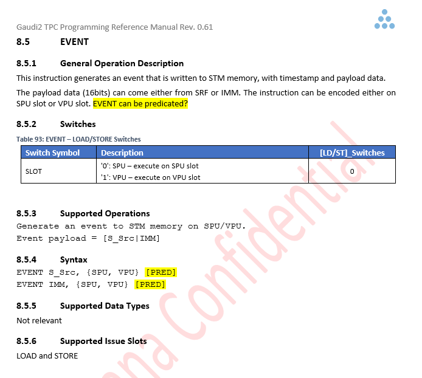
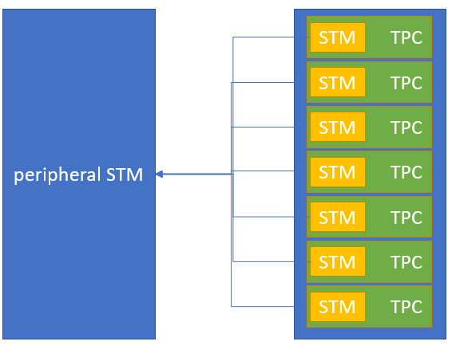

##################
TPC EVENT Profiler
##################

****************
Overview Guadi2:
****************

This documentation covers the following subject:

#. Event instruction.
#. User story.
#. Compiler Base Profiler using Event instruction
    #. Objectives
    #. Encoding

******************
Event instruction:
******************
The profiler is a great tool to help the developer to develop their topology.
Today, this is done via reading an STM event. The profiler producing his report by reading a centeral STM report.
This report is a collaction of all peripheral STM. 
The local STMs are signal the centeral STM with two events: begin and end.

To further get more detailed information. The Guadi2 extended his support for a trigger event.
The event instruction support two time phases. First, scalar and the second a vector.
To trigger the correct time the user must use the correct instruction in the current slot.

The Evenet instruction triggers an event to the STM in two time pashe. In a scalar time (using switch=0) or at VPU (using switch=1).
The instruction pass the message to the local STM and to the centeral. The message can encode with immidate or with a SRF.

Example of massage:

.. code-block:: C

    EVENT.VPU 0x10000001 //[byte type|7 bytes inforamtion]
    EVENT.VPU %SRF1 //[byte type|7 bytes inforamtion]

***********
User story:
***********
#. The compiler will support a new flag call TPCEvent.
#. The input to the flag is an integer:
    #. Basic block oriented.
#. When a user using the TPCEvent flag. The compiler shall inject an instruction according to the mode.
#. The compiler shall use the following encoding convention (as described in the encoding paragraph).
#. The profiler will be responsible to interpret correctly the convention according to the encoding.

Basic block orinted:
--------------------

.. code-block:: C
   :linenos:

    main:
            EVENT 0x00000001;nop;    nop; 	nop;
            nop; 	add.i32  b11111 I3, I1, I0, SP0; 	nop; 	cache_invalidate  SP0
            nop; 	mov_irf_dim  0x0 S2, I0, SP0; 	nop; 	nop
            nop; 	mov_irf_dim  0x0 S3, I3, SP0; 	nop; 	nop
            nop; 	nop; 	nop; 	nop
            nop; 	nop; 	nop; 	nop
            nop; 	shl.i32  S2, S2, 0x6, SP0; 	nop; 	nop
            nop; 	shl.i32  S3, S3, 0x6, SP0; 	nop; 	nop
            nop; 	nop; 	nop; 	nop
            nop; 	nop; 	nop; 	nop
            nop; 	nop; 	nop; 	nop
            nop; 	cmp_geq.i32  SP1, S2, S3, SP0; 	nop; 	nop
            nop; 	nop; 	nop; 	nop
            nop; 	jmpr .LBB0_11, SP1; 	nop; 	nop
            nop; 	nop; 	nop; 	nop
            mov.f32  V0, S0, SP0; 	mov_irf_dim  0x1 S5, I0, SP0; 	nop; 	set_indx  I2, b11111, 0x0, SP0
            nop; 	mov_irf_dim  0x1 S6, I3, SP0; 	mov.f32  V1, S1, SP0; 	nop
            nop; 	mov_irf_dim  0x2 S0, I0, SP0; 	nop; 	nop
            nop; 	mov_irf_dim  0x2 S1, I3, SP0; 	nop; 	nop
            nop; 	mov_irf_dim  0x3 S4, I0, SP0; 	nop; 	nop
            nop; 	shl.i32  S5, S5, 0x2, SP0; 	nop; 	nop
            nop; 	shl.i32  S6, S6, 0x2, SP0; 	nop; 	nop
            nop; 	mov_irf_dim  0x3 S7, I3, SP0; 	nop; 	nop
            nop; 	mov_irf_dim  0x4 S8, I0, SP0; 	nop; 	nop
            nop; 	mov_irf_dim  0x4 S9, I3, SP0; 	nop; 	nop
            nop; 	add.i32  S10, S5, 0x4, SP0; 	nop; 	nop
            nop; 	cmp_less.i32  SP1, S5, S6, SP0; 	nop; 	nop

    .LBB0_2:
            EVENT 0x00000002;nop;nop; 	nop;
            set_indx  I2, b00001, S2, SP0; 	nop; 	nop; 	nop
            loop S8, S9, 1, <, .LBB0_10
            nop; 	nop; 	nop; 	nop

    .LBB0_3:
            EVENT 0x00000003;nop ;nop; 	nop;
            set_indx  I2, b10000, S32, SP0; 	nop; 	nop; 	nop
            loop S4, S7, 1, <, .LBB0_9
            nop; 	nop; 	nop; 	nop

    .LBB0_4:
            EVENT 0x00000004;nop;    nop; 	nop;
            set_indx  I2, b01000, S33, SP0; 	nop; 	nop; 	nop
            loop S0, S1, 1, <, .LBB0_8
            nop; 	nop; 	nop; 	nop

    .LBB0_5:
            EVENT 0x00000005;nop;    nop; 	nop;
            nop; 	nop; 	nop; 	nop
            nop; 	nop; 	nop; 	nop
            nop; 	nop; 	nop; 	nop
            set_indx  I2, b00010, S5, SP0; 	set_indx  I2, b00100, S34, SP0; 	nop; 	nop
            ld_tnsr  V2, 0x0, I2, SP0; 	mov  b11111 I3, I2, SP0; 	nop; 	nop
            nop; 	add.i32  b00010 I3, 0x1, I3, SP0; 	nop; 	nop
            ld_tnsr  V3, 0x0, I3, SP0; 	add.i32  b00010 I3, 0x1, I3, SP0; 	nop; 	nop
            ld_tnsr  V4, 0x0, I3, SP0; 	add.i32  b00010 I3, 0x1, I3, SP0; 	nop; 	nop
            loop S10, S6, 4, <, .LBB0_7, SP1
            ld_tnsr  V5, 0x0, I3, SP0; 	add.i32  b00010 I3, 0x1, I3, SP0; 	nop; 	nop

    .LBB0_6:
            EVENT 0x00000006;nop;    nop; 	nop;
            nop; 	nop; 	sel_grt.f32     V6, V2, 0x0, V0, V1, SP0; 	nop
            nop; 	nop; 	sel_grt.f32     V7, V3, 0x0, V0, V1, SP0; 	nop
            nop; 	nop; 	sel_grt.f32     V8, V4, 0x0, V0, V1, SP0; 	nop
            nop; 	nop; 	sel_grt.f32     V9, V5, 0x0, V0, V1, SP0; 	nop
            ld_tnsr  V2, 0x0, I3, SP0; 	add.i32  b00010 I3, 0x1, I3, SP0; 	mul.f32  V6, V2, V6, SP0; 	nop
            ld_tnsr  V3, 0x0, I3, SP0; 	add.i32  b00010 I2, 0x1, I2, SP0; 	mul.f32  V7, V3, V7, SP0; 	st_tnsr  0x1, I2, V6, SP0
            nop; 	add.i32  b00010 I3, 0x1, I3, SP0; 	mul.f32  V6, V4, V8, SP0; 	st_tnsr  0x1, I2, V7, SP0
            ld_tnsr  V4, 0x0, I3, SP0; 	add.i32  b00010 I2, 0x1, I2, SP0; 	mul.f32  V7, V5, V9, SP0; 	nop
            nop; 	add.i32  b00010 I3, 0x1, I3, SP0; 	nop; 	st_tnsr  0x1, I2, V6, SP0
            nop; 	nop; 	nop; 	nop
            nop; 	nop; 	nop; 	nop
            ld_tnsr  V5, 0x0, I3, SP0; 	add.i32  b00010 I2, 0x1, I2, SP0; 	nop; 	nop
            nop; 	add.i32  b00010 I3, 0x1, I3, SP0; 	nop; 	st_tnsr  0x1, I2, V7, SP0
            nop; 	add.i32  b00010 I2, 0x1, I2, SP0; 	nop; 	nop

    .LBB0_7:
            EVENT 0x00000007;nop;    nop; 	nop;
            nop; 	mov  b11111 I3, I2, SP0; 	sel_grt.f32     V6, V2, 0x0, V0, V1, SP0; 	nop
            nop; 	nop; 	sel_grt.f32     V7, V3, 0x0, V0, V1, SP0; 	nop
            nop; 	nop; 	sel_grt.f32     V8, V4, 0x0, V0, V1, SP0; 	nop
            nop; 	nop; 	sel_grt.f32     V9, V5, 0x0, V0, V1, SP0; 	nop
            nop; 	add.i32  b00010 I3, 0x1, I3, SP0; 	mul.f32  V2, V2, V6, SP0; 	nop
            nop; 	nop; 	mul.f32  V3, V3, V7, SP0; 	st_tnsr  0x1, I2, V2, SP0
            nop; 	add.i32  b00010 I3, 0x1, I3, SP0; 	mul.f32  V2, V4, V8, SP0; 	st_tnsr  0x1, I3, V3, SP0
            nop; 	add.i32  b00010 I3, 0x1, I3, SP0; 	mul.f32  V2, V5, V9, SP0; 	st_tnsr  0x1, I3, V2, SP0
            nop; 	nop; 	nop; 	st_tnsr  0x1, I3, V2, SP0

    .LBB0_8:
            EVENT 0x00000008;nop;    nop; 	nop;
            nop; 	nop; 	nop; 	nop
            nop; 	nop; 	nop; 	nop

    .LBB0_9:
            EVENT 0x00000009;nop;    nop; 	nop;
            nop; 	nop; 	nop; 	nop
            nop; 	nop; 	nop; 	nop

    .LBB0_10:
            EVENT 0x000000010;nop;   nop; 	nop;
            nop; 	add.i32  S2, S2, 0x40, SP0; 	nop; 	nop
            nop; 	nop; 	nop; 	nop
            nop; 	nop; 	nop; 	nop
            nop; 	nop; 	nop; 	nop
            nop; 	cmp_less.i32  SP2, S2, S3, SP0; 	nop; 	nop
            nop; 	nop; 	nop; 	nop
            nop; 	jmpr .LBB0_2, SP2; 	nop; 	nop

    .LBB0_11:
            EVENT 0x000000011;nop;    nop; 	nop;
            nop; 	nop; 	nop; 	nop
            nop; 	nop; 	nop; 	nop
            nop; 	halt; 	halt; 	nop
            nop; 	nop; 	nop; 	nop
            nop; 	nop; 	nop; 	nop
            nop; 	nop; 	nop; 	nop

    .section .IndexMap
    SCEVBEGIN IndexSpace:[0].[Input].{ 64, 0, 1, 1, 1 }[1].[Output].{ 64, 0, 1, 1, 1 } #SCEVEND

    .section .tpc_metadata
        version: DD 8
        specialFunctionUsed: DB 0
        printfUsed: DB 0
        lockUnLock: DB 0
        march: DW 1
        mmioUsed: DB 0
        paramsNum: DB 2

Event IMMIDATE encoding protocal:
---------------------------------

+------+---------+
| Byte | 7 Bytes |
+======+=========+
|Type  |  info   |
+------+---------+